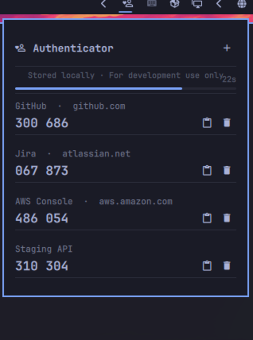

# omarchy-totp

A TOTP authenticator bar widget for [Omarchy](https://omarchy.org/) — designed for developers who create and test accounts frequently and need MFA codes without picking up their phone.

> **This plugin is intended for development use only.** It stores secrets in plain-text JSON on your local filesystem. Do not use it as a replacement for a proper authenticator app for accounts that matter.

---

## What it does

Every software project eventually asks you to set up MFA on a staging environment, a test Jira instance, or an AWS sandbox account. You create the account, scan the QR code on your phone, and then spend the rest of the sprint unlocking your phone every time you log in.

This plugin puts those codes where they belong: in your desktop bar, one click away.



- **Live codes** — 6-digit TOTP codes shown for every saved account, formatted as `123 456` for easy reading.
- **30-second countdown** — a progress bar shows exactly how much time remains before the current code expires. The bar turns red in the final 5 seconds.
- **One-click copy** — click the copy icon to send the code to your clipboard instantly. The icon turns into a checkmark to confirm it worked.
- **Add accounts** — paste a Base32 secret key, give it a name, and optionally an issuer. The secret is validated before saving.
- **Delete accounts** — remove accounts you no longer need, immediately.
- **No dependencies** — the backend is pure Python using only the standard library (`hmac`, `hashlib`, `base64`). Nothing to install.

---

## Installation

```bash
omarchy plugin add https://github.com/hpolthof/omarchy-totp.git
```

Then add it to your bar:

```bash
omarchy bar move io.github.hpolthof.totp --section right
```

The shield icon appears in the bar. Click it to open the panel.

---

## Adding an account

Open the panel and click **+**. Fill in:

| Field | Required | Description |
|---|---|---|
| Account name | Yes | A label you recognize — e.g. `GitHub` or `Jira staging` |
| Secret key | Yes | The Base32 string from the QR code setup screen (most services show this as a fallback to scanning) |
| Issuer | No | The service name or domain — shown as a subtitle under the account name |

Click **Save account**. The code appears immediately.

---

## The bar widget


The shield icon is dimmed when no accounts are saved. Once accounts are added, a tooltip shows the count. The icon is active (highlighted) while the panel is open.

---

## How TOTP works

TOTP ([RFC 6238](https://datatracker.ietf.org/doc/html/rfc6238)) generates a 6-digit code from a shared secret and the current Unix timestamp, divided into 30-second windows. The code is deterministic: anyone with the same secret produces the same code at the same time.

This plugin computes codes entirely locally using HMAC-SHA1, the same algorithm as Google Authenticator and most other TOTP clients.

---

## Storage and security

- Secrets are stored in `~/.config/omarchy/totp/accounts.json`, with permissions set to `0600` (owner read/write only).
- Codes are computed on your machine. Nothing is sent over the network.
- The plugin runs unsandboxed inside `omarchy-shell`, like all Omarchy plugins — see the [Omarchy plugin security model](https://plugins.omarchy.org/develop) for what that means.
- Input lengths are capped (name and issuer: 128 chars; secret: 200 chars) and the account ID format is validated before any file operation.
- **Do not store secrets for accounts you cannot afford to lose control of.** This is a developer convenience tool, not a security product.

---

## IPC

The plugin registers the target `io.github.hpolthof.totp`:

```bash
omarchy-shell shell call io.github.hpolthof.totp open
omarchy-shell shell call io.github.hpolthof.totp close
omarchy-shell shell call io.github.hpolthof.totp toggle
omarchy-shell shell call io.github.hpolthof.totp refresh
```

---

## License

MIT — see [LICENSE](LICENSE).
